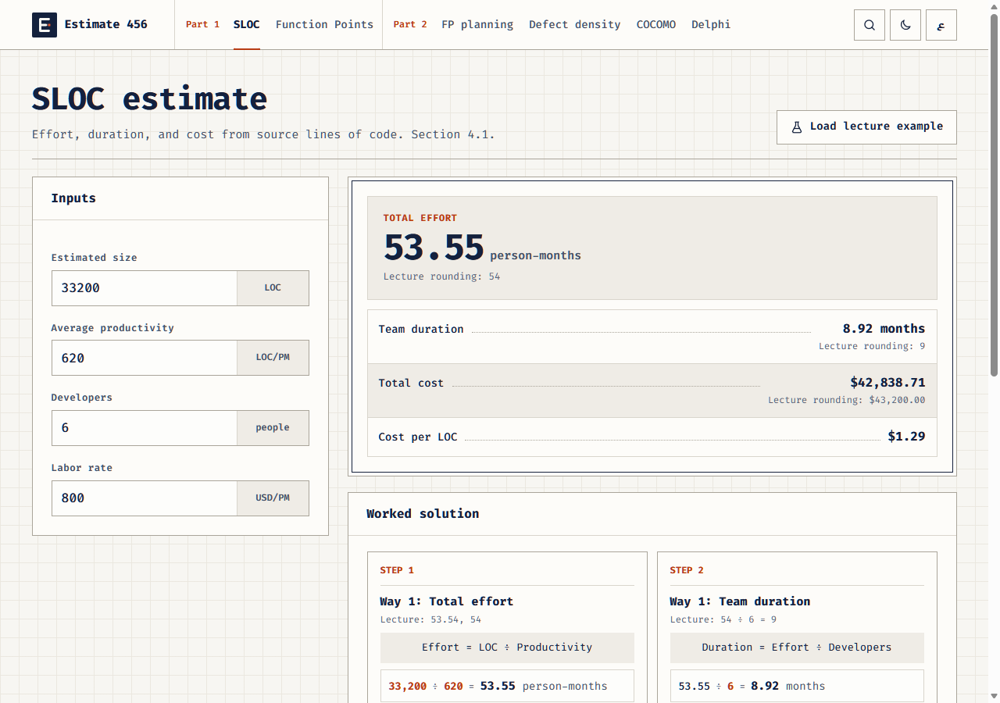

# Estimate 456

Software project estimation calculators for the CPIT 456 course, built from the lecture *Measuring Effort for Software Project*. Every result shows the formula with the numbers you entered, so the answer can be checked step by step. English and Arabic, light and dark.

**Live site:** https://estimate-456.vercel.app


## What it calculates

| Part | Method | Lecture section |
|---|---|---|
| Part 1, Chapter 1 | SLOC: effort, team duration, and cost, both ways shown in the lecture | 4.1 |
| Part 1, Chapter 1 | Function Points: CT from five weighted counts, ΣFi from F1 to F14, VAF, FP, and LOC | 4.2 |
| Part 2, Chapter 4 | FP planning: hours, person-months, cost | 4.2.3, 4.2.4 |
| Part 2, Chapter 4 | Defect density | 4.2.5 |
| Part 2, Chapter 4 | COCOMO: Basic, Intermediate (15 cost drivers, EAF), and Advanced (per phase), each for organic, semi-detached, and embedded | 4.3 |
| Part 2, Chapter 4 | Delphi: percentage of variance and A / NA | 4.4 |

All eleven course tables are included. Where the lecture names something without printing its values (the COCOMO duration equations, the Intermediate multiplier matrix, the Advanced phase split), the app says so and asks for the value instead of inventing it. [`docs/TRACEABILITY.md`](docs/TRACEABILITY.md) maps every formula to its lecture page, its exact and lecture-rounded result, and the test that covers it.

| Worked solution | Dark theme |
|---|---|
|  |  |

## Repository layout

```
web-app/          HTML, CSS, and JavaScript app (no build step), tests, packaging script
streamlit-app/    Python and Streamlit version of the same calculators, with tests
shared/fixtures/  Calculation cases both versions must pass
assets/           Logo, fonts with licenses, icons
docs/             Formula traceability and screenshots
design.md         Visual rules
launch.bat        Start either app on Windows
stop.bat          Close the ports the apps use
```

Course PDFs, backups, local environments, and secrets are not part of the repository.

## Run locally

```powershell
launch.bat
```

Or open one app directly: `web-app\launch.bat` or `streamlit-app\launch.bat`. The web app is plain files and runs from disk. The Streamlit launcher creates its own Python environment on first run.

## Tests

```powershell
cd web-app
node --test "tests/*.test.js"      # calculations, fixtures, translations, repository checks
node tests/e2e/run-e2e.mjs         # every page in both languages, both themes, six screen widths

cd ..\streamlit-app
python -m unittest discover -s tests   # Streamlit pages and parity with the JavaScript results
```

## Deploy

`web-app/` is the source; `site/` is generated.

```powershell
cd web-app
node tools/build-site.js
cd ..\site
npx vercel@latest deploy          # preview first
npx vercel@latest promote <preview-url>
```

## Author

Made by Hassan Asiri.
