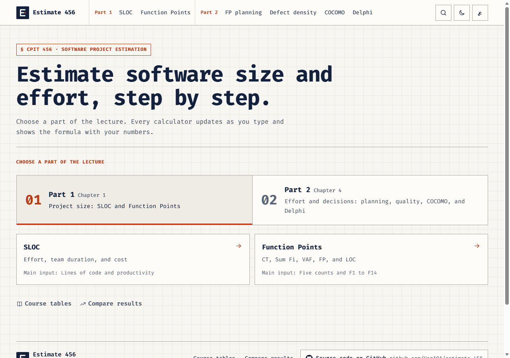
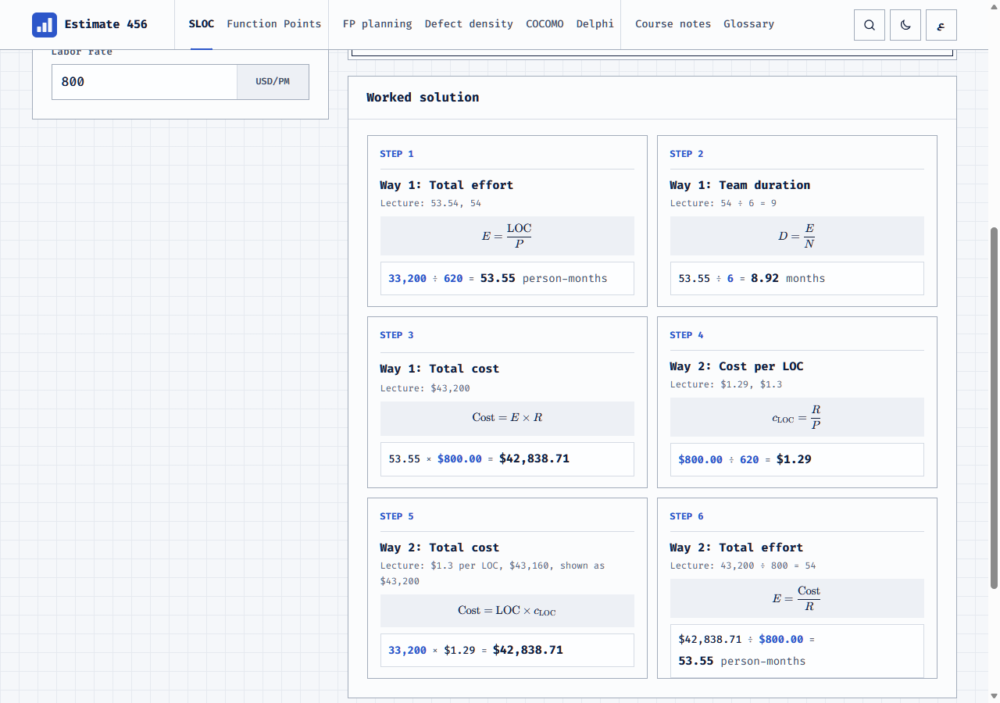
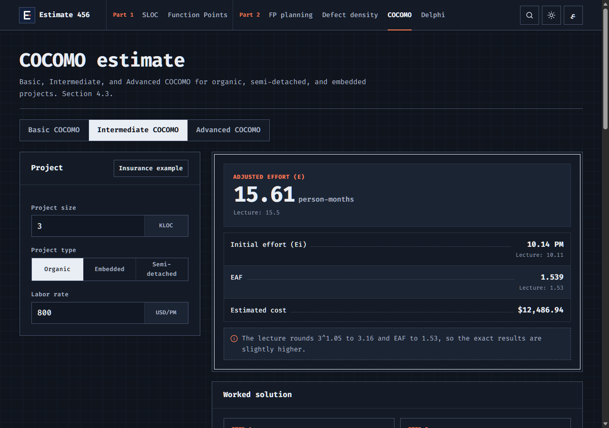

<p align="center">
  
</p>

<h1 align="center">Estimate تقدير 456</h1>

<p align="center">
  Software project estimation calculators for CPIT 456. Every result shows its
  formula with your numbers, in English and Arabic.
</p>

<p align="center">
  <a href="https://estimate-456.vercel.app"><strong>estimate-456.vercel.app</strong></a>
</p>

<p align="center">
  
</p>

## What it does

- **Follows the lecture in two parts.** Part 1 (Chapter 1) measures size with
  SLOC and Function Points. Part 2 (Chapter 4) turns size into effort, cost,
  and decisions with FP planning, defect density, COCOMO, and Delphi.
- **Shows the work.** Each calculator writes the solution step by step:
  the formula typeset as math, then the formula with your values, then the
  answer. Lecture-rounded values are shown beside the exact ones.
- **All three COCOMO levels.** Basic, Intermediate (15 cost drivers and EAF),
  and Advanced (effort per phase), each for organic, semi-detached, and
  embedded projects, with development time and staff.
- **Learn pages.** Course notes explain every topic from the lecture, the
  slides, and the COCOMO article read in class. The glossary defines every
  term and symbol, from LOC and KLOC to EAF and Tdev.
- **Never invents a value.** Where the course material does not print a value
  (the Intermediate multiplier matrix, the Advanced phase split), the app asks
  for it and says why. [docs/TRACEABILITY.md](docs/TRACEABILITY.md) maps each
  formula to its lecture page and its test.
- **Bilingual and accessible.** Full RTL Arabic, light and dark themes,
  and keyboard support.

<table>
  <tr>
    <td width="50%"></td>
    <td width="50%"></td>
  </tr>
  <tr>
    <td align="center"><sub>SLOC: every step shows the formula, then your numbers in it</sub></td>
    <td align="center"><sub>Intermediate COCOMO in the dark theme</sub></td>
  </tr>
</table>

## Get the software

You do not need to install anything. Pick the way that suits you:

| You want to | Do this |
|---|---|
| use it now | open [estimate-456.vercel.app](https://estimate-456.vercel.app) in any browser, on a computer or a phone |
| keep a copy that works offline | on this page click **Code**, then **Download ZIP**. Extract the ZIP, then double-click `launch.bat` on Windows, or open `web-app/index.html` in any browser on Windows, macOS, or Linux |
| follow updates with Git | `git clone https://github.com/HsnAQA/estimate-456.git`, then open `web-app/index.html` |

Your inputs are saved in your own browser only. Nothing is sent to a server.


## How it is built

```text
web-app/index.html ── js/  logic.js    pure calculations (no DOM)
                      │    data.js     course tables
                      │    i18n.js     English and Arabic strings
                      │    content.js  course notes and glossary
                      │    math.js     formulas as TeX
                      │    ui.js, app.js, motion.js
                      ├── css/styles.css
                      └── vendor/ KaTeX (math), anime.js (motion)

shared/fixtures/calculations.json   lecture cases every calculation must pass
```

There is no build step and no framework: the web app is plain HTML, CSS, and
JavaScript and runs straight from disk. More in
[docs/ARCHITECTURE.md](docs/ARCHITECTURE.md).

## Tech stack

| Layer | Technology |
|---|---|
| Web app | HTML, CSS, vanilla JavaScript |
| Math and motion | KaTeX 0.19, anime.js 4.5 (both vendored, MIT) |
| Fonts | Fira Code (English text), Josefin Sans (English headings), Alexandria (Arabic); all open license |
| Tests | Node test runner and a headless browser suite |
| Hosting | Vercel, deployed from this repository on every push to `main` |

## Tests

```powershell
cd web-app
node --test "tests/*.test.js"   # calculations, fixtures, translations, repository checks
node tests/e2e/run-e2e.mjs      # every page, both languages, both themes, six widths
```

The same checks run on every push in GitHub Actions. Details in
[docs/DEVELOPMENT.md](docs/DEVELOPMENT.md).

## Where things are

```text
web-app/          the web app: index.html, css/, js/, vendor/, tests/, tools/
shared/fixtures/  calculation cases computed from the lecture
assets/           logo, fonts with licenses, icons
docs/             design, architecture, development, deployment, traceability
.github/          issue and pull request templates, test workflow
```

## Documentation

| Guide | For |
|---|---|
| [CONTRIBUTING.md](CONTRIBUTING.md) | your first branch, commit, and pull request |
| [docs/DEVELOPMENT.md](docs/DEVELOPMENT.md) | commands, tests, and troubleshooting |
| [docs/ARCHITECTURE.md](docs/ARCHITECTURE.md) | how the files fit together |
| [docs/DEPLOYMENT.md](docs/DEPLOYMENT.md) | preview, publish, and roll back |
| [docs/TRACEABILITY.md](docs/TRACEABILITY.md) | every formula, its source, and its test |
| [docs/DESIGN.md](docs/DESIGN.md) | visual rules |
| [docs/CHANGELOG.md](docs/CHANGELOG.md) | history of changes |
| [SECURITY.md](SECURITY.md) | reporting a problem privately |
| [assets/README.md](assets/README.md) | fonts, icons, and their licenses |

Course PDFs, lecture documents, backups, local environments, secrets, and the
Ministry of Culture font files are not part of the repository.

Made by Hassan Asiri for CPIT 456, King Abdulaziz University.
